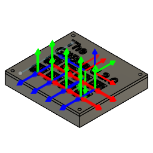
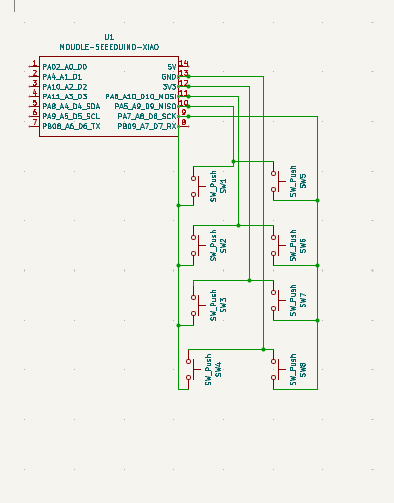
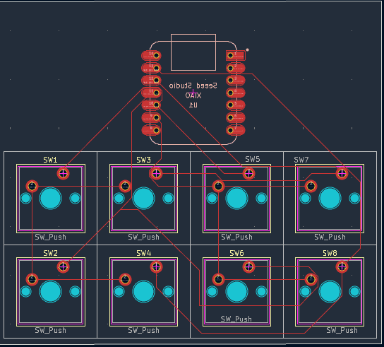
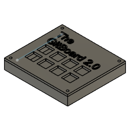

# GitBoard 2.0


## Project Description
GitBoard 2.0 is an **8‑key Git‑focused macropad** powered by the **Seeeduino XIAO RP2040**.  
It automates common Git commands using **CircuitPython** or **QMK**, making version control faster and more intuitive.

The board uses a **2×4 layout**, **direct‑wired switches**, and a custom PCB designed in **KiCad**.  
Each key triggers a Git command such as `git status`, `git add .`, or `git commit -m ""`.

---

# 📸 Required Images

## 1. Macropad Render


## 2. Schematic Screenshot


## 3. PCB Layout Screenshot


## 4. Case / 3D View Screenshot


---

## 🛠️ Hardware
- Microcontroller: Seeeduino XIAO (RP2040)
- Switches: 8 × momentary push buttons
- Layout: 2 rows × 4 columns
- Wiring: Direct pins (D0–D7)
- Connection: USB‑C
- Power: 5 V from USB
- Design Software: KiCad 7.x

---

## 💻 CircuitPython Firmware Example

```python
import board, digitalio, usb_hid
from adafruit_hid.keyboard import Keyboard

kbd = Keyboard(usb_hid.devices)

pins = [board.D0, board.D1, board.D2, board.D3, board.D4, board.D5, board.D6, board.D7]
commands = [
    "git status\n",
    "git add .\n",
    "git commit -m \"\"\n",
    "git push\n",
    "git pull\n",
    "git checkout -b newbranch\n",
    "git merge main\n",
    "git log --oneline\n"
]

switches = [digitalio.DigitalInOut(pin) for pin in pins]
for sw in switches:
    sw.direction = digitalio.Direction.INPUT
    sw.pull = digitalio.Pull.UP

while True:
    for i, sw in enumerate(switches):
        if not sw.value:
            kbd.send_string(commands[i])
```

---

## ⚙️ QMK Firmware
The QMK firmware for this board is located in the `firmware/` folder.

### Matrix Layout
Direct‑wired 2×4 matrix:

```
Row 0 → D0, D1, D2, D3  
Row 1 → D4, D5, D6, D7
```

---

## 📦 Bill of Materials (BOM)

| Item | Quantity | Description | Footprint |
|------|----------|-------------|-----------|
| Seeeduino XIAO | 1 | Microcontroller | MODULE‑SEEEDUINO‑XIAO |
| Tactile Switch | 8 | Momentary push button | SW_Push |
| Custom PCB | 1 | Designed in KiCad | — |
| USB‑C Cable | 1 | Power + data | — |
| Solder | — | Assembly | — |
| Keycaps | 8 | For labeling | — |
| Case | 1 | 3D printed enclosure | — |
| Screws | 4 | M3×16 | — |

---

## 🧰 License
MIT License

---

## 🚀 Future Ideas
- RGB LEDs  
- OLED display  
- QMK layers  
- Custom keycaps  
- Encoder support  
- Hotswap sockets  